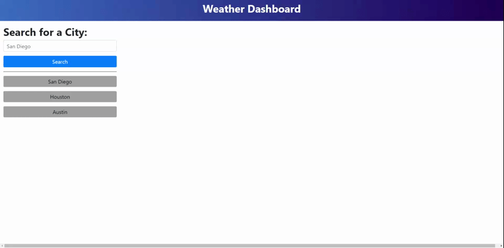

# uta-weather-dashboard

deployment: https://brandonnorsworthy.github.io/uta-weather-dashboard/

### About
Weather Dashboard using Open Weather API that runs in the browser and features dynamically updated HTML and CSS. Uses local storage to store persistent data.

### Demo

  
**the white flashes are when the page gets refreshed**

## Homework Assignment Given Design


### Functionality
* Calls openWeather CurrentWeather api for latest weather and to grab the longitude and latitude.
* Calls openWeather One Call api to grab the future 5 day forcast at the same location and displays them in cards at the bottom of the page
* dynamically creates ```<div class="row">``` as well as ```<div class="columns">```
* Styled using the [Bootstrap Framework](https://getbootstrap.com/)
* Stores users events in the DOMs local storage object so it can be loaded on page load.
* Gets accurate dates and formats them using the [Moment.js Library](https://momentjs.com/)